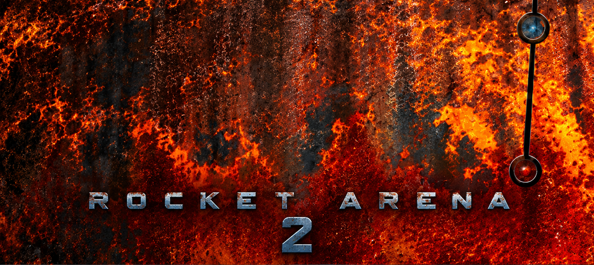

# Rocket Arena 2 for the Quake II rerelease

This is the **Rocket Arena 2 v2.25** gametype, ported to the game DLL of the 2023 Quake II rerelease by Nightdive Studios.

Rocket Arena 2 (RA2) is a Quake II arena-combat mod supporting competitive one-on-one duels and team play, originally released publicly in 1998. It was developed by David "crt" Wright and Mungo; Wright was also associated with GameSpy.

A map is divided into independent arenas: self-contained combat spaces, each running its own warm-up, countdown, fight, and results cycle. Players queue in teams -- which may consist of a single player -- and teams reaching the front of the queue are matched against opponents and placed in an available arena to fight a predetermined number of rounds.

Items are removed from the arenas to keep matches fast-paced and to provide a more equal competitive setting. Instead, every player spawns with the same equipment loadout configured for that arena.

## Install

1. Unzip the [release](../../releases) package into the rerelease's mods directory. On Windows that is under your user profile, which keeps the original game files untouched:

   ```
   %USERPROFILE%\Saved Games\Nightdive Studios\Quake II\
   ```

2. Launch the game with `+set game arena`.

   Steam: Right-click on "Quake II" → Properties → Launch Options → enter: `+set game arena`
   Then start the game as usual.

## Starting a match

**From the launcher.** In the multiplayer match setup, choose the game mode **Deathmatch** and one of the `ra2mapN` arenas. Deathmatch *is* Rocket Arena here. The map picker chooses the *starting* map only; from there, `arena.cfg`'s `maploop` drives the rotation. For your first session, try a famous classic map like `ra2map16`, `ra2map17` or `ra2map24`. Add bots to your liking, but be aware that their pathfinding is currently poor because their `.nav` files were auto-generated and still need some tweaking.

**From the console.** `map ra2map1`.

Picking Cooperative, Capture the Flag or Team Deathmatch turns RA2 off and gives you that mode instead; so does the console command `set ra2 0`.

Any deathmatch map works, not just the RA2 ones. A map with no arena markup runs as a single-arena pickup game covering the whole level.

## Playing

The whole game is driven from an in-game menu:

| Key | Command | Does |
|---|---|---|
| `TAB` | `inven` | open / close the menu |
| `[` `]` | `invprev` / `invnext` | move the selection |
| `ENTER` | `invuse` | select |

You start as an observer. The menu walks you through the MOTD, then **Choose your team** (start a new one or join an existing one), then **Choose Your Arena**. Once your team is at the head of that arena's queue and an opponent is available, the round starts and you are teleported in. Between rounds you watch from the audience. When starting out, try joining one of the existing pickup teams. That way you'll get teleported to one of the larger and more interesting arenas.

### Console commands

Type these as `cmd <name>` (for example `cmd menuhelp`).

| Command | Does |
|---|---|
| `menuhelp` | print the menu key bindings |
| `listmaps` | print the map rotation from `arena.cfg` |
| `nextmap` | print the next map in the rotation |
| `listkeys [block ...]` | dump a block of the parsed `arena.cfg` |
| `id` | toggle the name of the player under your crosshair |
| `grap_on` / `grap_off` | offhand grapple hold/release, where `arena.cfg` enables it -- bind as a `+`/`-` alias pair |
| `admin <code>` | server admin menu -- fraglimit, timelimit, next map |
| `arenaadmin <code> [arena]` | per-arena settings menu, bypassing the vote |

`admin` and `arenaadmin` need the numeric `admincode` cvar to be set to something other than 0. Note that the code travels to the server as a plain console command; treat it as a convenience for a friendly server, not as authentication.

Without an admin code, arena settings still change by vote: **Change Arena Settings** in the observer menu proposes a change, **Vote on Changes** decides it. `arena.cfg` controls which settings may be voted on at all.

## Server configuration

### cvars

| cvar | Default | Does |
|---|---|---|
| `ra2` | `1` | the ruleset toggle. Latched; forces `deathmatch 1` and turns coop/CTF/teamplay off |
| `admincode` | `0` | numeric code for `admin` / `arenaadmin`; `0` disables both |
| `arenacfg` | `arena.cfg` | config filename, relative to the gamedir |
| `logfile` | `0` | `2` enables the RA2 match log |
| `logname` | `stdlog.log` | match log filename, written next to the game DLL |

The match log records player names, connects, kills and pings, and is off unless `logfile` is `2`. The format is StdLog 1.22 -- not an id format, but Mark Davies' "Standard Logging" library that the competition mods of the era shared, so existing parsers read it unchanged.

`logfile` is the engine's own console-logging cvar; RA2 piggybacks on it and reads the value `2` as "also write the StdLog". That is the donor's behaviour, kept so existing server configs work.

### `arena.cfg`

The per-map arena configuration, read once per level load. Semicolon-terminated `key: values;` lines, `//` comments, and `name { ... }` blocks:

```
maploop: ra2map1 ra2map2 ra2map3;   // rotation; overrides the launcher's list
votetries: 3;                       // settings proposals each player may make
grapple: 0;                         // offhand grapple on/off
armor: 200;                         // defaults every arena inherits
health: 200;

ra2map1 {                           // per-map overrides
  1 {                               // per-arena overrides, arena number 1
    weapons: 2 3 4 5 6 7 8 9;
    armor: 50;
    rounds: 3;
  }
  7 {
    weapons: 2 3 4 5 6 7 9;
    pickup: 1;                      // no team queue: two standing sides,
                                    // join and leave at any time
    rounds: 9;
  }
}
```

Settings resolve in that order -- built-in defaults, then the file's top level, then the map block, then the arena block -- so an arena only has to name what it changes.

`weapons` uses the number key you would press for the weapon: `2` shotgun, `3` super shotgun, `4` machinegun, `5` chaingun, `6` grenade launcher, `7` rocket launcher, `8` hyperblaster, `9` railgun, `0` BFG10K.

Per-arena keys: `weapons`, `armor`, `health`, `rounds`, `playersperteam`, `maxteams`, `pickup`, `minping`, `maxping`, `rocketspeed`, `shells`, `bullets`, `slugs`, `grenades`, `rockets`, `cells`, `fastswitch`, `armorprotect`, `healthprotect`, `fallingdamage`, `lockarena`, `competitionmode`, `damagescoring`, and an `allowvoting<setting>` toggle for each votable one. `armorprotect`/`healthprotect` take `0` damage all, `1` don't damage team, `2` damage self but not team.

### `motd.txt`

Plain text, shown to each player on their first spawn. One screen of it.

Both files are resolved next to the game DLL first, then relative to the `game` cvar. The rerelease runs with the read-only install directory as its working directory while the gamedir lives under your user profile, so the DLL's own directory is the only reliable base.

### Maps

RA2 maps mark up their arenas with an `arena` key: worldspawn carries the arena count, and spawn points, teleporters and triggers carry the arena they belong to. A map without that markup -- any stock deathmatch map -- becomes a single pickup arena covering the level.

## Building

**Windows**, Visual Studio 2022 or 2019. The dependencies (`fmt`, `jsoncpp`) come from vcpkg via `rerelease/vcpkg.json`, so a vcpkg-enabled VS install pulls them in on first build.

```
open rerelease/game.sln
build Release|x64
```

The output is `game_x64.dll`, one directory above `rerelease/`.

**Linux**, GCC or Clang, from the `Makefile`:

```sh
sudo apt-get install libjsoncpp-dev
make -j"$(nproc)"                 # -> game_x64.so
```

That one builds as C++20, so `q_std.h` formats through `std::format` and fmtlib drops off the dependency list, leaving jsoncpp. Nightdive shipped no native PC build for it -- Steam is Windows-only and the Deck runs the Windows DLL under Proton -- so the `.so` is for source ports that implement the rerelease game API, and for the second compiler's opinion on the code.

macOS has no build system here. The preprocessor definitions the module needs are in `rerelease/game.vcxproj` and the `Makefile`; id's own documentation of the rerelease game API is in the [upstream repository](https://github.com/id-Software/quake2-rerelease-dll).

## Differences from 1998 Rocket Arena 2
* **Chat** goes through the engine's lobby, so RA2's arena-scoped `say` and its spam kicker are not portable.
* **Statistics reporting.** Neither RA2's GameSpy pipeline nor any local round log is ported. Only the local text log in `gslog.cpp` records match activity.
* **Network logging.** RA2's `netlog` UDP forwarding to a third-party collector is gone. The donor's stock config pointed it at the author's own domain, which is long parked and now resolves to an unrelated host, so keeping it would have reported player names, kills and pings to a stranger on every frag.
* **ZBot detection.** ZBot was a late-1990s Quake II auto-aim proxy cheat; the donor's detection for it is not ported, since the cheat itself is long extinct.

Deliberate improvements:

* **Pickup arenas** spawn fighters on a free spot rather than drawing blindly from the side's spawn list, which matters on maps RA2 was never designed around.
* **Engine bots** are told RA2 is a team game, and see at most two sides.

## Bug reports

Found a bug? Please report it on the [issue tracker](https://github.com/Niehztog/quake2-rerelease-dll-ra2/issues).

Questions or comments: niehz.tog@gmail.com

## Credits

* **Rocket Arena 2** by David "crt" Wright and Mungo, 1998. The ruleset here follows the v2.25 sources.
* **Quake II** and the 2023 rerelease game source by Nightdive Studios.
* This port is not affiliated with, or endorsed by, either.

## Licence

GPL-2.0, the same as the upstream rerelease game source. See [`LICENSE.txt`](LICENSE.txt).